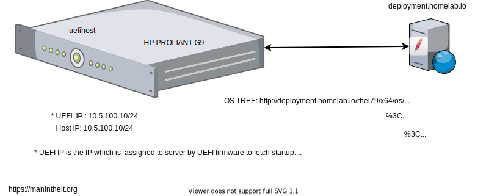
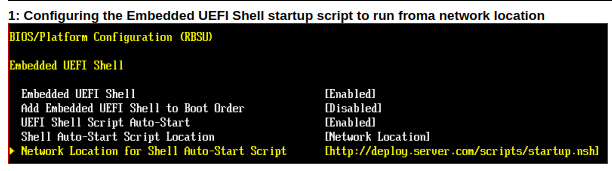

## Fully Automated Bare-Metal OS Installation - No (i)PxE

This is the repo for installing OS on Bare-Metal server fully automated way without any (i)PxE requirements such as TFTP and DHCP.
Scripts and config files on that repo were tested on HP Server Proliant Gen9(iLO4) with ```Red Hat Enterprise Linux 7.9```.


## How it Works

There is one deployment server on which running Apache HTTP server. It servers all necessary installation scripts and RHEL 7.9 binaries (os tree) in specific DocumentRoot. Bare-Metal Server is configured to pull ```startup.nsh``` from remote HTTP server and execute it. Basically, the script creates initial ramdisk with FAT16 format including a label, downloads ```vmlinuz```, ```initrd.img```, ```grub.cfg```, ```grubx64.efi``` binaries and execute  ```grubx64.efi``` which starts the grub menu including necessary kernel parameters.





## Configuring the Embedded UEFI Shell to Read the StartupScript from the Network
Using the System Utilities

Complete the pre-boot network configuration describedfor HTTP boot (Using the System Utilities), but do not enter data in the Bootfrom URL field. This field is only needed for booting from an ISO image or EFI application.

Enable UEFI Shell Script Auto Start. By default this is disabled. See “UEFI Shell Script Auto-start” in the UEFISystem Utilities guide for ProLiant Gen9 Severs.

Set the auto-start location to Network. See ```"Shell Auto-startScript Location"``` in the HPE UEFI System Utilities Guidefor HPE ProLiant Gen9 Severs.

Set the location (URL) where the Embedded UEFI Shell downloads the script. See Configuring the Embedded UEFI Shell startup script to run from a network location and **"Network Location for Shell Auto-startScript"** in the UEFI System Utilities guide for ProLiantGen9 Severs.

**Save your setting.**

**Note:** You must set the URL statically to point to an Embedded UEFIShell script (.nsh). No other files are supported.

## Sample Configuration




**Source:** https://support.hpe.com/hpesc/public/docDisplay?docId=emr_na-c05088252


## References: 

- [HPE1](https://support.hpe.com/hpesc/public/docDisplay?docId=a00028432en_us&docLocale=en_US)
- [HPE2](https://support.hpe.com/hpesc/public/docDisplay?docId=emr_na-c05088252)
- [UEFI](https://www.intel.com/content/dam/support/us/en/documents/motherboards/server/sb/efi_instructions.pdf)

